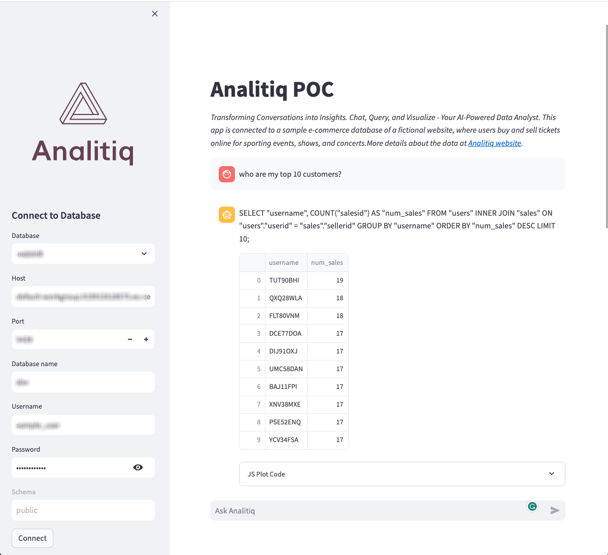

# AI Data Analyst by Analitiq
Analitiq is a cutting-edge application designed to revolutionize the way businesses interact with their data. By leveraging the power of natural language processing, Analitiq allows users to input queries through a simple chat interface and effortlessly generates SQL queries compatible with PostgreSQL, Redshift, and other SQLAlchemy-supported databases. This user-friendly interface demystifies data analysis, making it accessible to a wider range of professionals, regardless of their technical expertise.

## Table of Contents
1. [Installing Requirements](#installing-requirements)
2. [Setting Up](#setting-up)
3. [Running Analitiq](#running-analitiq)
4. [Limitations](#limitations)
5. [Dependencies](#dependencies)
6. [Contributing](#contributing)
7. [License](#license)
8. [Support](#support)

## Installing the requirements
Ensure you have Docker, Git, and Python (>= 3.9) installed. Use the following commands to install Git and Docker:
```
sudo yum update -y
sudo yum install git -y
sudo yum install docker -y
sudo service docker start
```

## Pulling the Git repository
Clone the repository and build the Docker image:
```
git clone {REPO URL}
cd app
sudo docker build -t dockerfile .
```

## Setting up
### Credentials
Store your DB connection credentials and AI API key in `.streamlit/secrets.toml`.
```
openai_api_key = "your-openai-api-key"

[db_credentials]
host = "your-db-host"
port = your-db-port
username = "your-username"
password = "your-password"
database = "your-database"
schema = "your-schema"
```

### Context
Providing information about your table structure in `.streamlit/secrets.toml` enhances query understanding and accuracy.

## Run Analitiq on localhost
Navigate to the cloned repository directory and run:
```
pip install -r requirements.txt
streamlit run app/core.py
```

Access the app at http://localhost:8501

Once the app is running in your browser, you can
1. Input or edit database connection details.
2. Input your questions, just like you would with a data analyst and click Ask.
3. If you don't get the desired results then be precise about the tables and columns that contain the requested data in your natural language query.




## Limitations
- AWS Redshift is the only supported database at the moment.
- The app scans tables inside your public schema. Other schemas are ignored.
- Asking questions that require table joins might not always work. The app will try to figure out the joins, but it might not always be successful. In such cases you can help the app by providing [context](#contet) about your tables.

## Dependencies
You need an OpenAI API key to use this app. You can get one [here](https://platform.openai.com/)
Based on the [llama-index](https://github.com/jerryjliu/llama_index) project.
Uses [Streamlit](https://streamlit.io/) for the UI.

## License
This project is licensed under the [MIT License](https://opensource.org/licenses/MIT).