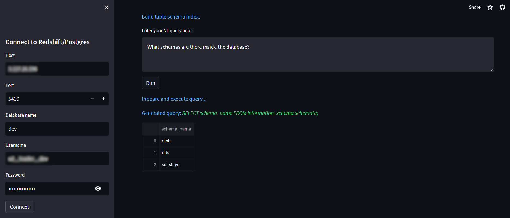

# Natural Language to SQL Query Generator(nl2sql)
Streamlit App for natural language to SQL query generation. Tested with Postgres and Redshift connections but any SQLAlchemy compatible database should work. You need an OpenAI API key to use this app. You can get one [here](https://platform.openai.com/)

- [Natural Language to SQL Query Generator(nl2sql)](#natural-language-to-sql-query-generatornl2sql)
  - [💻Example Usage](#example-usage)
    - [Start on localhost:](#start-on-localhost)
  - [Known Limitations](#known-limitations)
  - [🔧Dependencies](#dependencies)

## 💻Example Usage

TLDR: Click on the [link](https://nl2sql-sagedata.streamlit.app/) to see it in action.

### Start on localhost:

Requires python >= 3.9

```
pip install -r requirements.txt

streamlit run n2lsql/nl2sql.py
```

Navigate to your streamlit app at http://localhost:8501


1. Input database connection details.
2. Enter your OpenAI Api key.
3. Select the GPT model from OpenAI to use.
4. Input your natural language query and click RUN.
5. If you use DBT for data modelling, copy/pasting the DBT sources.yaml contents in the text area will vastly help the app to understand your data model. Alternatively pasting any metadata about the tables in your database will help the app to understand your data model.
6. If you don't get the desired results then be precise about the tables and columns that contain the requested data in your natural language query.
7. The natural language query is converted to a SQL query and the results are displayed in a table.




## Known Limitations
- AWS Redshift is the only supported database at the moment.
- The app scans tables inside your public schema. Othe schemas are ignored.
- Asking questions that require table joins might not always work. The app will try to figure out the joins but it might not always be successful. In such cases you can help the app by providing metadata about your tables in the DBT sources yaml input(regardless if it is DBT sources yaml compliant metadata).

## 🔧Dependencies
You need an OpenAI API key to use this app. You can get one [here](https://platform.openai.com/)

Based on the awsome [llama-index](https://github.com/jerryjliu/llama_index) project. Uses [Streamlit](https://streamlit.io/) for the UI.
